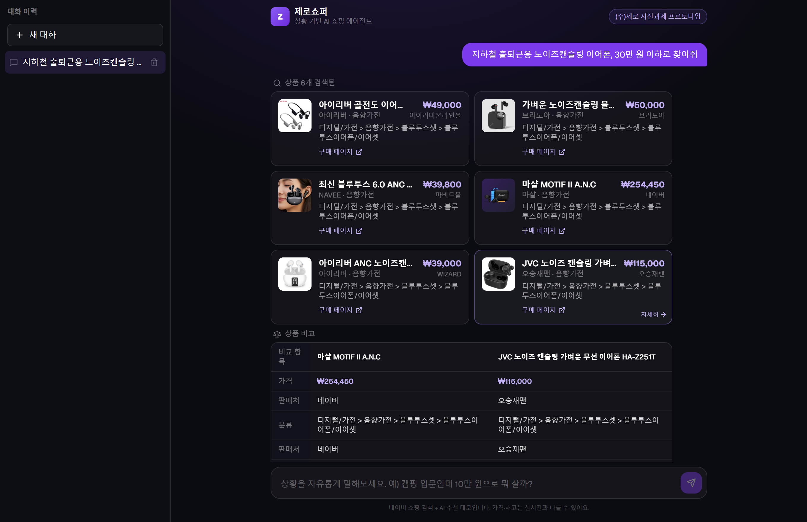
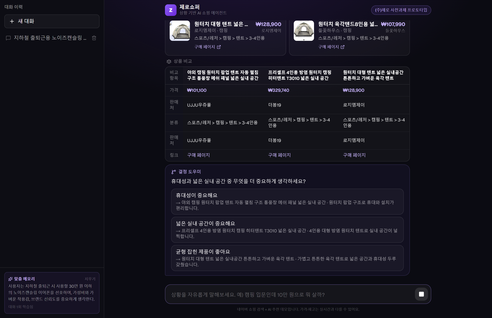
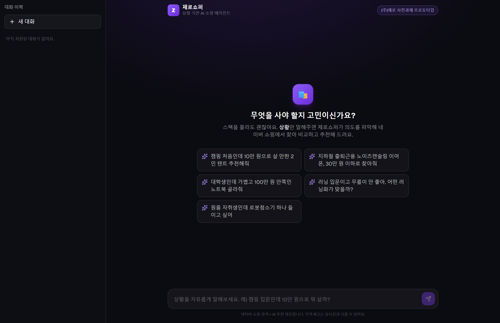
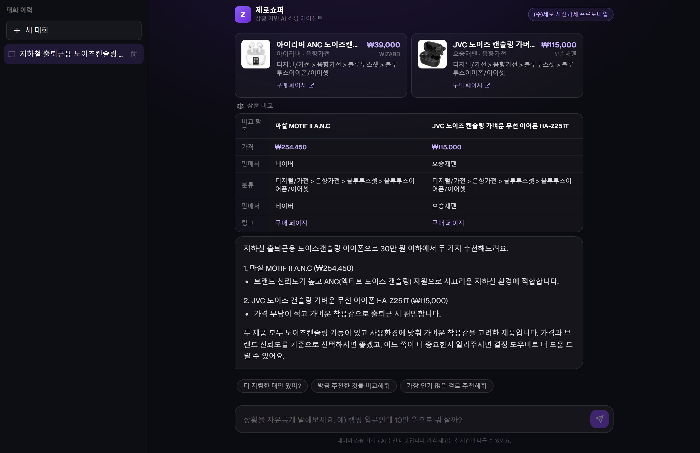
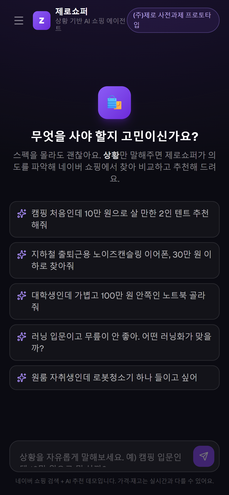
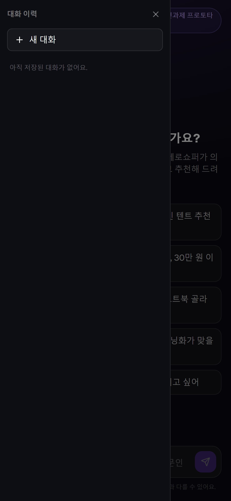

# 🛍️ 제로쇼퍼 (ZeroShopper)

> **상황 기반 AI 쇼핑 큐레이션 에이전트** — 스펙을 몰라도, 처한 "상황"만 말하면 의도를 해석해 상품을 검색·비교·추천합니다.
>
> (주)제로 「AI 에이전트 서비스 개발자」 사전 과제 프로토타입

| 항목 | 내용 |
| --- | --- |
| **배포 URL** | **https://zero-shopper.vercel.app** |
| **GitHub** | https://github.com/bat1120/zero-shopper |
| **미리보기** | 아래 [스크린샷](#미리보기) 참고 |
| **테스트 계정** | 별도 로그인 없음 — 접속 즉시 사용 가능 |

---

## 미리보기

**상황을 말하면 → 네이버 쇼핑 실시간 검색 → 상품 카드 → 비교표 → (필요 시) 결정 도우미 → 근거 기반 추천**, 그리고 모든 대화는 좌측 사이드바에 저장됩니다.



**결정 도우미** — 비교 후에도 우열이 안 갈리면, 사용자의 우선순위(트레이드오프)를 묻고 그 답에 맞는 최종 1택으로 좁혀 줍니다.



| 첫 화면 (상황 입력 유도) | 비교표 · 근거 기반 추천 |
| :---: | :---: |
|  |  |

<details>
<summary>📱 모바일 화면 (반응형 · 대화 이력 오버레이)</summary>

<p>
  
  &nbsp;&nbsp;
  
</p>

</details>

> 스크린샷은 실제 배포본을 헤드리스 Chrome으로 캡처합니다 — 재생성: `npm i -D playwright-core && node scripts/shoot.mjs`

---

## 1. 문제 정의

온라인 쇼핑에서 사람들이 진짜 어려워하는 건 "검색"이 아니라 **판단**입니다.

- 상품명·스펙을 모르면 검색창에 무엇을 칠지조차 막막하다. (`"캠핑 입문 텐트"`를 검색해도 수백 개가 쏟아진다)
- 후보를 찾아도 *내 상황(예산·용도·제약)* 에 무엇이 맞는지 스스로 비교·판단해야 한다.

**제로쇼퍼**는 이 "판단"을 대신해 주는 에이전트입니다. 사용자는 키워드가 아니라 **상황**을 말합니다.

> "캠핑 처음인데 10만 원으로 살 만한 2인 텐트 추천해줘"
> "지하철 출퇴근용 노이즈캔슬링 이어폰, 30만 원 이하로"
> "러닝 입문이고 무릎이 안 좋아. 어떤 러닝화가 맞을까?"

에이전트는 문장에서 **카테고리·예산·용도·제약**을 추출하고, **네이버 쇼핑(실시간)** 에서 검색·비교한 뒤, **왜 이 상황에 이 상품이 맞는지** 근거와 트레이드오프를 들어 추천합니다.

### 제로의 'AI-Native 커머스' 비전 안에서 — 제로쇼퍼가 다루는 범위

(주)제로는 *상품 탐색·추천·비교·구매 판단을 관통하는 **AI 커머스 에이전트***를 지향합니다. 사전 과제 프로토타입으로 그 풀퍼널을 전부 구현하기보다, **'의사결정' 구간(탐색~구매 판단)을 깊게** 다루고 결제 이후는 의식적으로 범위에서 제외했습니다.

| 커머스 여정 단계 | 제로쇼퍼 구현 |
| --- | --- |
| 발견·탐색 | ✅ 상황 기반 자연어 → 의도 파싱 → 하이브리드 RAG 검색 |
| 추천 | ✅ 상황·예산·용도에 연결한 근거 기반 추천 |
| 비교 | ✅ 비교표 도구로 스펙·장단점 대조 |
| **구매 판단(결정)** | ✅ **결정 도우미** — 트레이드오프 질문으로 최종 1택을 좁힘 |
| 재방문·개인화 | ✅ 대화 이력 + 개인화 메모리 |
| 결제·장바구니·배송 | ⛔ 프로토타입 범위에서 의도적으로 제외 |

---

## 2. 주요 기능

- 💬 **자연어 상황 입력 → 의도 파싱**: 예산·용도·제약을 LLM이 해석
- 🛒 **실시간 상품 검색 (네이버 쇼핑 API)**: 더미 카탈로그가 아닌 **실제 판매 상품**(이미지·가격·판매처·구매 링크)을 가져옴
- 🔎 **하이브리드 RAG 재랭킹 (RRF + Tool)**: 네이버 관련도 순위와 즉석 임베딩 의미 유사도를 **Reciprocal Rank Fusion**으로 융합해 의도에 맞게 재정렬 (라이브·더미 경로 모두 정량 평가: [검색 평가 문서](docs/search-eval.md))
- ⚖️ **상품 비교 (Tool)**: 후보 2개 이상이면 핵심 스펙·장단점을 표로 비교
- 🔀 **결정 도우미 (Tool)**: 비교 후에도 우열이 갈리지 않으면, 객관 우위를 강요하는 대신 **사용자의 우선순위(트레이드오프) 질문 1개**를 제시 → 답을 고르면 그 우선순위에 맞는 **최종 1택**으로 좁혀 추천 (커머스 여정의 '구매 판단' 단계)
- 🧠 **근거 기반 추천**: 단순 나열이 아니라 "이 상황엔 A, 다만 B는 이런 트레이드오프" 식의 판단 제시
- ⚡ **실시간 스트리밍 UI**: SSE 기반으로 답변이 타이핑되듯 출력
- 🃏 **결과의 서비스화**: 도구 결과를 텍스트로 흘리지 않고 **상품 카드 · 비교표**로 렌더링
- 🔗 **바로가기 링크**: 답변 본문의 구매 링크·URL을 클릭 가능한 **"바로가기 ↗"** 하이퍼링크로 렌더링(긴 URL이 말풍선을 넘치지 않게 축약, 새 탭으로 상품 페이지 이동)
- ❓ **부족한 정보는 역질문**: 추천에 결정적인 정보(예산·용도)가 없으면 한 가지만 되물음
- 💾 **대화 이력 저장 (Supabase)**: 매 턴 대화를 저장하고, 사이드바에서 과거 대화를 열람·이어가기·삭제 (익명 세션 기반, 미설정 시 자동 비활성화)
- 🧬 **개인화 메모리 (점진 학습)**: 대화가 끝날 때마다 사용자의 **지속적 선호**(예산 성향·관심 카테고리·생활 맥락)를 LLM이 누적 추출 → 다음 질문 때 프롬프트에 주입해 점점 맞춤화된 추천. *모델 파인튜닝이 아니라 "에이전트 메모리"* 방식. 사이드바에서 메모리 확인·초기화 가능

---

## 3. 사용 기술 스택

| 구분 | 기술 |
| --- | --- |
| 프레임워크 | **Next.js 16 (App Router)** · React 19 · TypeScript |
| 스타일 | **Tailwind CSS v4** (헤드리스 UI 스타일의 자체 컴포넌트) |
| AI / 에이전트 | **Vercel AI SDK v5 (`ai`, `@ai-sdk/openai`, `@ai-sdk/react`)** |
| LLM | **OpenAI (기본 `gpt-4.1-mini`)** · Function/Tool Calling |
| 상품 데이터 | **네이버 쇼핑 검색 API** (실시간) · 미설정 시 더미 카탈로그로 폴백 |
| 대화 이력 | **Supabase (Postgres)** · 익명 세션별 저장/조회 · 미설정 시 자동 비활성화 |
| 개인화 | 대화 기반 **선호 프로필**(LLM 누적 추출 → 프롬프트 주입) · `next/server` `after()`로 응답 후 갱신 |
| 검색(RAG) | **OpenAI `text-embedding-3-small` 임베딩 + 코사인 유사도** · 의미 재랭킹 / 의미+어휘 하이브리드 |
| 검증 | **Zod** (도구 입력 스키마) |
| 스트리밍 | **SSE** (`toUIMessageStreamResponse` / `useChat`) |
| 배포 | **Vercel** |

> 공고의 권장 스택(React · Next.js · TypeScript · Tailwind · Vercel AI SDK · SSE · Tool Calling · Zod)에 맞춰 구성했습니다.

---

## 4. 실행 방법

```bash
# 1) 의존성 설치
npm install

# 2) 환경변수 설정
cp .env.local.example .env.local
#   .env.local 을 열어 OPENAI_API_KEY=sk-... 를 채웁니다.

# 3) 개발 서버
npm run dev          # http://localhost:3000

# 4) 프로덕션 빌드
npm run build && npm run start
```

**필수 환경변수**

| 키 | 설명 |
| --- | --- |
| `OPENAI_API_KEY` | OpenAI API 키 (필수) |
| `NAVER_CLIENT_ID` | 네이버 개발자센터 「검색」 API 클라이언트 ID (선택). 설정하면 실시간 네이버 쇼핑 검색 사용 |
| `NAVER_CLIENT_SECRET` | 네이버 검색 API 클라이언트 시크릿 (선택) |
| `SUPABASE_URL` | Supabase 프로젝트 URL (선택). 설정하면 대화 이력 저장 활성화 |
| `SUPABASE_SERVICE_ROLE_KEY` | Supabase service_role 키 (선택, **서버 전용** — 클라이언트 노출 금지) |
| `OPENAI_CHAT_MODEL` | 사용할 모델 (선택, 기본 `gpt-4.1-mini`). 비용을 더 아끼려면 `gpt-4o-mini` 로 교체 가능 |

> - `OPENAI_API_KEY`가 없으면 `/api/chat`이 친절한 안내 메시지를 반환하므로 화면이 깨지지 않습니다.
> - 네이버 키가 **없으면** 자동으로 내장 더미 카탈로그(34개 상품) RAG 검색으로 폴백합니다. 즉 네이버 키 없이도 데모가 동작합니다.
> - Supabase 키가 **없으면** 대화 이력 기능만 비활성화되고(사이드바는 "이력 저장 꺼짐" 표시) 나머지는 그대로 동작합니다.

**Supabase 설정(대화 이력)**: ① [supabase.com](https://supabase.com)에서 프로젝트 생성 → ② SQL Editor에 [`docs/supabase-schema.sql`](docs/supabase-schema.sql) 붙여넣고 실행 → ③ Project Settings > API에서 `URL`과 `service_role` 키를 복사해 위 환경변수에 설정.

---

## 5. LLM / Agent 동작 구조

```
사용자 입력(상황)
   │
   ▼
[useChat] ──POST /api/chat──► [streamText + system prompt]
                                   │
          ┌──────────────┬─────────┴────┬──────────────┐
          ▼              ▼              ▼              ▼
  search_products  compare_products  decision_guide  get_product_detail   ← Tool(Function) Calling
          │              │              │              │
          └──── 도구 실행 결과를 모델에 반영(멀티스텝 루프) ──────────────┘
                                   │  (stopWhen: 최대 6스텝)
                                   ▼
                       최종 추천 텍스트 + 도구 결과 스트리밍(SSE)
                                   │
                                   ▼
   상품 카드 · 비교표 · 결정 도우미 · 추천 근거로 렌더링 (message.parts 단위)
```

**판단 흐름의 핵심** — 이 과제의 평가 포인트인 *"단순 LLM API 호출이 아니라, 에이전트가 어떤 흐름으로 판단·행동하는가"* 에 맞춰 설계했습니다.

1. **의도 파싱**: 시스템 프롬프트가 모델에게 "카테고리·예산·용도·제약을 먼저 파악"하도록 지시. 결정적 정보가 없으면 역질문.
2. **행동(도구 호출)**: 모델이 스스로 `search_products`를 호출(예산은 `maxPrice`, 용도는 `useCase`로 매핑). 후보가 여럿이면 `compare_products`로 비교.
3. **멀티스텝 루프**: `stopWhen: stepCountIs(6)` 으로 *검색 → (결과 보고) → 비교 → 최종 답변* 의 연쇄를 허용.
4. **근거화**: 도구 결과를 받아 사용자의 상황과 연결해 추천 이유·트레이드오프를 생성.

> "GPT 래퍼"와의 차이: 모델이 **무엇을·언제 검색/비교할지 스스로 결정**하고, 그 결과를 **구조화된 서비스 경험(카드/표)** 으로 연결합니다.

### 도구(Tools) 정의

| 도구 | 입력 | 역할 |
| --- | --- | --- |
| `search_products` | `query, keywords, category, minPrice, maxPrice, useCase, sortBy, limit` | 의미(RAG)+어휘 하이브리드로 후보 검색. `query`(자연어 의도)는 임베딩 검색에 사용 |
| `compare_products` | `productIds[]` (≥2) | 핵심 스펙·장단점 비교 |
| `decision_guide` | `question, options[{label, productId, reason}]` | 비교 후 트레이드오프 질문 + 우선순위별 후보 제시(구매 판단 보조) |
| `get_product_detail` | `productId` | 단일 상품 상세 |

---

## 6. 데이터 흐름

- **검색 진입점**: `searchProductsAuto()` 가 자격증명 유무로 소스를 자동 선택합니다.
  - **라이브 (네이버 키 있음)**: `searchNaver()` 가 네이버 쇼핑 검색 API를 호출해 실제 상품(제목·가격·이미지·판매처·구매 링크)을 가져옴 → 결과를 **즉석 임베딩**해, **네이버 관련도 순위 + 의미 유사도 순위를 RRF(Reciprocal Rank Fusion)로 융합**해 재랭킹(`searchProductsLive`). 상품 임베딩은 인메모리 캐시(`liveEmbedCache`)로 재사용. 카테고리에 묶이지 않아 **거의 모든 상품**을 검색할 수 있음.
  - **폴백 (네이버 키 없음 / 라이브 0건)**: 내장 더미 카탈로그(`lib/products.ts`, 9개 카테고리 **34개 상품**)로 하이브리드 RAG 검색(`searchProductsSemantic`).
- **사전 RAG 색인 (폴백 경로)**: 더미 상품 임베딩은 빌드 타임에 미리 생성해 `lib/product-embeddings.json`에 저장(`scripts/build-embeddings.ts`). 런타임에는 **쿼리만 임베딩**해 코사인 유사도를 계산하고 **의미 유사도(45%) + 어휘 점수(55%)**를 합산해 정렬.
- **라이브 상품 캐시**: 네이버 상품은 영속 저장소가 없어 한 요청 안에서 검색→비교/상세 도구가 ID로 다시 찾을 수 있도록 `lib/product-store.ts` 의 인메모리 캐시에 보관.
- **토큰 최적화**: 도구가 LLM에 돌려주는 결과는 핵심 필드로 슬림화. UI는 동일 `output`을 받아 카드/표를 그립니다.
- **상태**: 대화 상태는 `useChat`이 클라이언트에서 관리. 각 메시지는 `parts`(텍스트/도구 호출/도구 결과)로 구성되어 파트 단위로 렌더링.
- **대화 이력(Supabase)**: 클라이언트가 익명 세션 ID(localStorage)와 대화 ID를 transport body에 실어 보내고, `/api/chat`의 `onFinish`에서 전체 `UIMessage[]`를 Supabase `conversations` 테이블에 upsert. 사이드바는 `/api/conversations`(목록)·`/api/conversations/[id]`(로드/삭제)를 호출. 쓰기·읽기는 모두 서버(service_role)로만 이뤄지고 RLS로 공개 접근을 차단(브라우저는 Supabase에 직접 접속하지 않음).
- **개인화 메모리(점진 학습)**: `/api/chat`은 응답 생성 전 세션의 선호 프로필(`user_profiles`)을 로드해 시스템 프롬프트에 `[사용자 메모리]` 블록으로 주입하고, 응답 종료 후 `after()`로 *방금 대화에서 지속적 선호만 보수적으로* 추출해 프로필을 누적 갱신(LLM `generateObject`). **이번 질문의 명시적 조건이 항상 메모리보다 우선**하도록 가드. 서버리스에서 fire-and-forget은 함수가 얼어붙어 중단되므로 `next/server`의 `after()`로 응답 후 실행을 보장. 사이드바의 "맞춤 메모리" 카드에서 요약 확인·초기화(`/api/profile` GET·DELETE).

---

## 7. 본인이 중점적으로 구현한 부분

- **에이전트의 "판단 흐름" 설계**: 시스템 프롬프트 + 4종 도구(검색·비교·결정도우미·상세) + 멀티스텝 루프로 *의도 파싱 → 도구 행동 → 결정 보조 → 근거 추천* 파이프라인 구성.
- **실시간 상품 API 연동**: 네이버 쇼핑 검색 API를 연동해 실제 판매 상품(이미지·가격·판매처·구매 링크)을 검색. 라이브/더미를 자동 전환하고, 라이브 상품용 인메모리 캐시로 비교·상세 도구를 지원.
- **도구 결과의 서비스화**: 도구 `output`을 그대로 흘리지 않고 `message.parts`를 파싱해 **상품 카드(실이미지·구매 링크) / 비교표 / 결정 도우미 카드 / 진행 상태 칩**으로 렌더링 → "실제 쇼핑 경험"에 가깝게.
- **RAG 재랭킹·하이브리드 검색**: 라이브 결과는 **RRF(네이버 순위 + 의미 순위 융합)**로 재랭킹, 더미 폴백 경로는 의미 유사도 + 어휘(동의어·태그가중) 점수를 결합해 평가 셋으로 튜닝(45:55).
- **정량 평가 하네스 2종** → [docs/search-eval.md](docs/search-eval.md):
  - **더미 경로**: 라벨 25개 쿼리로 Top-1/Recall@3/MRR (초기 어휘 68% → 개선 어휘·RAG **Top-1 100%**).
  - **라이브 경로**: 고정 라벨이 없어 **LLM-as-judge(RAGAS류)**로 후보 적합도를 채점해 nDCG@5/Precision@3/MRR 측정. 재랭킹이 네이버 원순서보다 우위(MRR 0.820 → **0.861**)임을 검증.
- **E2E 회귀 하네스**(`npm run test:e2e[:llm]`): 입력 검증(잘못된 본문 → 400), 라우트 소유·존재(없는 대화 → 404), LLM 행동(역할 게이트·검색·결정 도우미), 크로스턴 상품 복원까지 18개 케이스를 자동 검증하고 실패 시 exit 1로 게이트. 다회 감사(서버/클라이언트/검색/아키텍처) → 수정 → 하네스 재실행 루프로 품질을 끌어올렸습니다.
- **UX 디테일**: 빈 화면 추천 프롬프트, 카드 클릭 상세, 후속 질문 칩, 스트리밍·중지·자동 스크롤, 키 미설정 시 graceful 에러, 모바일 대응.

---

## 8. 구현하지 못한 부분 (한계)

- **라이브 상품 메타데이터 한계**: 네이버 쇼핑 응답에는 평점·상세 스펙·장단점이 없어, 라이브 모드의 카드/비교표는 가격·판매처·이미지·구매 링크 위주로 표시됨(더미 카탈로그는 평점·장단점까지 제공).
- **정량 평가 범위**: 더미 경로는 고정 라벨 기반 Top-1/Recall@3/MRR로, 라이브 경로는 **LLM-as-judge** 기반 nDCG/Precision/MRR로 측정. 다만 라이브 평가는 심판이 단일 LLM이고 네이버 데이터가 시점에 따라 변해 절대 수치 재현성은 제한적(상대 비교 위주).
- **라이브 캐시 휘발성**: 라이브 상품은 인메모리 캐시(요청/프로세스 수명)라 영속 저장소·벡터 DB(pgvector 등) 연동은 미구현.
- **대화 이력은 익명 세션 기준**: 로그인이 없어 localStorage 세션 ID로 구분 → 브라우저/기기를 바꾸면 이력이 따라가지 않음(향후 인증 연동 시 사용자 단위로 확장 가능).
- **세션 ID = 접근 토큰(인증 부재, 의도적 단순화)**: 대화/메모리 접근 제어는 클라이언트가 보내는 `x-session-id`(localStorage UUID)에만 의존합니다. 서버는 이 값의 진위를 검증하지 않으므로, **타인의 세션 UUID를 알면 그 세션의 이력·메모리를 읽거나 삭제할 수 있습니다.** UUID가 추측 불가능한 점에만 기대는 구조라, 실서비스라면 서명된 토큰이나 실제 인증으로 대체해야 합니다(프로토타입 범위에서는 의도적으로 단순화). 서버 쓰기 키(`SUPABASE_SERVICE_ROLE_KEY`)는 서버 전용이며 RLS로 브라우저 직접 접근은 차단됩니다.
- **인증·장바구니·결제 없음**: 추천까지만 다루는 프로토타입 범위.

---

## 9. 향후 개선 방향

- 라이브 상품에 리뷰·상세 스펙 보강(상품 상세 페이지 크롤링/리뷰 API) + **리뷰 본문까지 색인하는 문서 단위 RAG**(벡터 DB·pgvector)로 "리뷰 요약·장단점 분석" 강화.
- 대화/추천 이력 저장(Supabase/Postgres)과 개인화(과거 선호 반영).
- **평가 셋 확대**: 현재 25개 라벨을 다수 평가자 합의 라벨로 키우고, 가중치·임베딩 차원 재튜닝(공고의 "LLM 응답 품질 검증" 항목과 연결).
- 상품 카드에서 바로 비교 담기 → 비교 트레이 → 장바구니로 이어지는 액션 루프.
- 임베더블 위젯 형태로 외부 쇼핑몰에 삽입(공고의 "임베더블 AI 위젯" 방향).

---

## 10. AI 개발 도구 활용 여부

본 프로토타입은 **Claude Code(Anthropic)** 를 페어 프로그래밍 도구로 활용해 설계·구현했습니다.

- 활용: 요구사항(공고) 분석, 아키텍처·도구 설계 논의, 보일러플레이트 및 컴포넌트 작성, 타입 오류 디버깅.
- 직접 결정: 주제 선정, 에이전트의 판단 흐름·도구 인터페이스 설계, 검색 랭킹 정책, UX 구성은 직접 정의하고 검토했습니다.

---

## 프로젝트 구조

```
app/
  layout.tsx                # 메타데이터·폰트·레이아웃
  page.tsx                  # 채팅 UI (useChat, 스트리밍, 사이드바, 세션/대화 관리)
  api/chat/route.ts         # 에이전트 라우트 (streamText + 4종 Tool + SSE + 이력 저장)
  api/conversations/route.ts        # 대화 목록 (GET)
  api/conversations/[id]/route.ts   # 대화 로드(GET)·삭제(DELETE)
  api/profile/route.ts              # 개인화 메모리 요약(GET)·초기화(DELETE)
  globals.css               # 다크 테마 · 디자인 토큰
components/
  product-card.tsx          # 상품 카드 / 그리드 (클릭 → 상세)
  compare-table.tsx         # 비교표
  decision-guide.tsx        # 결정 도우미 카드 (트레이드오프 질문 → 최종 1택 유도)
  sidebar.tsx               # 대화 이력 사이드바 (목록·새 대화·삭제)
  markdown-lite.tsx         # 의존성 없는 경량 마크다운 렌더러 (굵게·불릿·링크/URL → 바로가기 하이퍼링크)
lib/
  naver-shopping.ts         # 네이버 쇼핑 검색 API 클라이언트 (실상품 → Product 매핑)
  semantic-search.ts        # 검색 진입점: 라이브 재랭킹 / 더미 하이브리드 RAG · 자동 전환
  product-store.ts          # 라이브 상품 인메모리 캐시 (비교·상세 도구용)
  products.ts               # 더미 카탈로그 + 어휘 검색/필터/비교 로직 (폴백)
  supabase.ts               # 서버 전용 Supabase 클라이언트 (service_role)
  conversations.ts          # 대화 저장/목록/로드/삭제 데이터 레이어
  user-profile.ts           # 개인화 메모리: 선호 추출/주입/조회/삭제
  embed-text.ts             # 상품/쿼리 임베딩 텍스트 빌더
  product-embeddings.json   # 사전 생성된 더미 상품 임베딩 벡터
  types.ts · format.ts      # 도메인 타입 · 표시 포맷
scripts/
  build-embeddings.ts       # 더미 상품 임베딩 생성 (빌드 타임)
  eval-search.ts            # 더미 경로 평가 하네스 (Top-1/Recall@3/MRR)
  eval-live.ts              # 라이브 경로 평가 하네스 (LLM-as-judge · nDCG/P@3/MRR)
  test-harness.mjs          # E2E 회귀 하네스 (입력검증·라우트·LLM행동·크로스턴복원, exit code 게이트)
  shoot.mjs                 # README용 스크린샷 생성 (헤드리스 Chrome)
docs/
  supabase-schema.sql       # 대화 이력 테이블 스키마 (Supabase SQL Editor에서 실행)
  search-eval.md            # 검색 품질 정량 평가 결과
  demo-script.md            # 시연 영상 대본
  screenshots/              # README 미리보기 이미지
```
